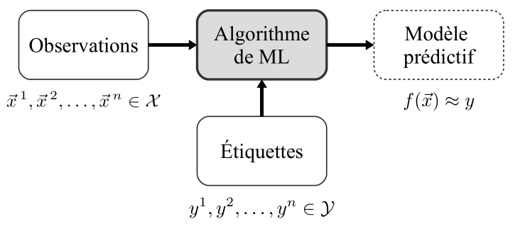
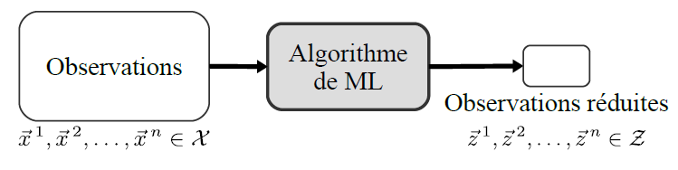

```{r setup, include=FALSE}
knitr::opts_chunk$set(echo = FALSE)
```

# Introduction

- Le Machine Learning ou apprentissage automatique est un domaine scientifique, et plus particulièrement une sous-catégorie de l'intelligence artificielle. Elle consiste à laisser des algorithmes découvrir des  "patterns", à savoir des motifs récurrents, dans les ensembles de données. Ces données peuvent être des chiffres, des mots, des images, des statistiques\ldots

-  Les algorithmes de Machine Learning apprennent de manière autonome à effectuer une tâche ou à réaliser des prédictions à partir de données et améliorent leurs performances au fil du temps. Une fois entraîné, l'algorithme pourra retrouver les patterns dans de nouvelles données.

- À l'intersection des statistiques et de l'informatique, le machine learning se préoccupe de la modélisation
des données.

---

Le machine learning repose sur deux piliers fondamentaux :

- d’une part, les données, qui sont les exemples à partir duquel l'algorithme va apprendre ;

- d'autre part, l'algorithme d'apprentissage, qui est la procédure que l'on fait tourner sur ces données
pour produire un modèle. On appelle __entraînement (training)__ le fait de faire tourner un algorithme d'apprentissage sur un jeu de données.

# Types de problèmes de machine learning

Le machine learning est un champ assez vaste, et nous dressons dans cette section une liste des plus
grandes classes de problèmes auxquels il s'intéresse.

- __Apprentissage supervisé__

L'apprentissage supervisé (supervised learning) est peut-être le type de problèmes de machine learning le plus facile à appréhender : son but est d'apprendre à faire des prédictions, à partir d'une liste d'exemples _étiquetés (label)_, c’est-à-dire accompagnés de la valeur à prédire.



---

- __Apprentissage non supervisé__

Dans le cadre de l'apprentissage non supervisé (unsupervised learning), les données ne sont pas étiquetées. Il s'agit alors de modéliser les données pour mieux les comprendre. En d'autres termes, il s"agit d'apprendre une fonction sur les données qui vérifient certaines propriétés.



---

- __Apprentissage par renforcement__

L'apprentissage par renforcement (Deep Learning) désigne l'ensemble des méthodes qui permettent à un agent d'apprendre à choisir quelle action prendre, et ceci de manière autonome.

L'algorithme interagit avec son environnement en réalisant des actions et en apprenant de ces erreurs et sucés.

# Points clefs

- Un algorithme de machine learning est un algorithme qui apprend un modèle à partir d'exemples, par le biais d'un problème d'optimisation.

- On utilise le machine learning lorsqu'il est difficile ou impossible de définir les instructions explicites à donner à un ordinateur pour résoudre un problème, mais que l'on dispose de nombreux exemples illustratifs.

- Les algorithmes de machine learning peuvent être divisés selon la nature du problème qu'ils cherchent
à résoudre, en apprentissage supervisé, non supervisé, et par renforcement.

# Logiciel et librairies

Dans ce cours, nous utiliserons le logiciel R pour illustrer des cas pratiques du machine learning. 

Il existe plusieurs librairies (packages) pour l'implémentation du machine learning;

`r "caret"`, `r "randomForest"`, `r "e1071"`, `r "mlr"`, `r "nnet"`, `r "rnn"` \ldots

