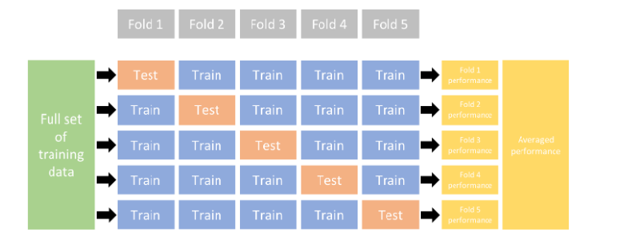

```{r setup, include=FALSE}
knitr::opts_chunk$set(message = F, comment=NA, warning = F,
                      class.output="shadebox")
def.chunk.hook  <- knitr::knit_hooks$get("chunk")
knitr::knit_hooks$set(chunk = function(x, options) {
  x <- def.chunk.hook(x, options)
  ifelse(options$size != "normalsize", paste0("\n \\", options$size,"\n\n", x, "\n\n \\normalsize"), x)
})
```

\definecolor{shadecolor}{RGB}{225, 225, 225}

# Introduction

L'apprentissage supervisé est classée dans deux catégories d'algorithmes:\pause

- $\color{red}{\bf{\text{Régression}:}}$ Un problème de régression se pose lorsque la variable étiquetée (labelled) est une valeur réelle.\pause 

Dans la littérature, il existe plusieurs types de modèles de régression tels que la régression linéaire, la régression logistique, le SVM (Support Vector Machine), NN (neural network) et KNN (K nearest neighbour), \ldots \pause

- $\color{red}{\bf{\text{Classification}:}}$ On parle d'un problème de classification lorsque la variable étiquetée est catégorielle (binaire ou multi-classes).\pause
 
Les modèles de classification comprennent la régression logistique, l'arbre de décision (tree decision), la forêt aléatoire (random forest), KNN et SVM.

\vspace*{3cm}

# La fonction coût (Cost (loss) function)

L'apprentissage statistique supervisé repose sur une hypothèse qui minimise le coût (la perte) moyen(ne) dans l'$\color{blue}{\bf{\text{échantillon}}}$. Ce qu'on appelle le problème minimisation du coût.\pause

La fonction d'un prédicteur $f$ est donné par: $\mathcal{R}(f)=\mathbb{E}\left(\ell\left(f(x)\right),y \right)$.

Le meilleur prédicteur est celui qui minimise cette fonction: $f^*=\min\left\{\mathcal{R}(f)\right\}$.\pause

L'estimateur de la fonction coût est:
$$
\mathcal{R}_n(f)=\dfrac{1}{n}\sum_i\ell\left(f(x_i),y_i \right)
$$

# La régression linéaire

La régression linéaire consiste à estimer $(k+1)$ paramètres dans une relation $\color{blue}{\bf linéaire}$ entre une variable dépendante (target) et $k$ variables indépendantes (features):
$$
y_i=\beta_0 + \beta_1 x_{1i}+\ldots +\beta_k x_{ki}+\varepsilon_i\qquad \qquad (Y=X\beta +\varepsilon)
$$

- $f$ est la relation linéaire entre $y_i$ et $x_{ki}$;

- $\ell$ peut être le coût de l'erreur quadratique:
$$
\ell(f(x),y)={\left(f(x)-y \right)}^2=\dfrac{1}{n}\sum_i {\left(x'_i\beta-y_i \right) }^2
$$

- Le meilleur prédicteur s'obtient en minimisant la fonction coût
$$
\widehat{f^*}=\min_{\beta}{\left(f(x)-y \right)}^2=\dfrac{1}{n}\sum_i {\left(x'_i\beta-y_i \right) }^2
$$

---

$\bf\color{blue}{\text{Implémentation sous R:}}$

- Dataset and exploration: La bibliothèque `MASS` contient l'ensemble de données de `Boston`, qui enregistre la `medv` (valeur mediane des maisons) pour 506 quartiers de Boston. Nous chercherons à prédire `medv` à l'aide de 13 prédicteurs tels que `rm` (nombre moyen de pièces par maison), `age` (âge moyen des maisons) et `lstat` (pourcentage de ménages à faible revenu).

```{r, size="footnotesize"}
library(MASS)  
names(Boston)      # Les noms des variables
any(is.na(Boston)) # y a t-il des valeurs manquantes?
```

---

- Model training and evaluation

Le problème fondamental de sur-estimation (overfitting) est que le risque empirique,  est biaisé à la baisse par rapport au risque de la population. Nous pouvons éliminer ce biais de deux manières : (a) des approches de ré-échantillonnage purement algorithmiques (train/test (échantillonnage aléatoire simple (EAS)) et k-fold cross validation (échantillonnage stratifié)) et (b) des estimateurs fondés sur la théorie.\pause

```{r,echo=FALSE,fig.align='center', out.height="50%", out.width="70%"}

```


---

- Spit data

```{r, size="footnotesize"}
set.seed(0123); n=nrow(Boston)
i_train=sample(1:n, round(0.7*n))
train=Boston[i_train,] ; test=Boston[-i_train,]
```

où encore, avec la bibliothèque `caret`

```{r, size="footnotesize"}
library(caret); set.seed(0123)
i_tr=createDataPartition(Boston[,1], p=0.7, list=F)
train2=Boston[i_tr,] ; test2=Boston[-i_tr,]
```

---

- Estimation

```{r, size="footnotesize"}
mod1=lm(medv ~ rm , data=train); summary(mod1)
```

---

```{r, size="footnotesize"}
mod2=update(mod1, .~. + lstat , data=train)
summary(mod2)
```

---

```{r, size="footnotesize"}
mod3=update(mod2, .~. + age, data=train)
summary(mod3)
```

---

On a estimé 3 modèles. La question qui se pose: quel est le meilleur modèle ? \pause

Pour répondre à cette question, on doit définir ce que veut dire "meilleur". Dans ce cas, on utilisera RMSE comme métrique et la validation croisée comme approche de re-échantillonnage.

```{r, size="footnotesize"}
set.seed(123)  
(cv_mod1 <- train(form = medv ~ rm, 
  data = train, method = "lm",
  trControl = trainControl(method = "cv", number = 10)))
```


---

```{r, size="footnotesize"}
set.seed(123)  
(cv_mod2 <- train(form = medv ~ rm + lstat, 
  data = train, method = "lm",
  trControl = trainControl(method = "cv", number = 10)))
```

---

```{r, size="footnotesize"}
set.seed(123)  
(cv_mod3 <- train(form = medv ~ rm + lstat + age, 
  data = train, method = "lm",
  trControl = trainControl(method = "cv", number = 10)))
```

---

```{r, size="footnotesize"}
# Extract out of sample performance measures
summary(resamples(list(model1 = cv_mod1, model2 = cv_mod2,
                       model3 = cv_mod3)))
```

--- 

L'estimation du modèle linéaire se repose sur le respect de quelques hypothèses (linéarité, variance constante, erreurs non corrolées, \ldots)\pause

Donc, l'étape de la validation consiste à vérifier si ces hypothèses sont bien remplies à travers des graphiques et des tests statistiques.
\vspace*{1cm}

```{r,size="footnotesize", fig.align='center', out.height="60%", out.width="60%"}
p1=ggplot(train,aes(medv, rm))+geom_point(size=1, alpha=0.4)+geom_smooth(se=F)

p2=ggplot(train,aes(medv, rm))+geom_point(size=1, alpha=0.4)+geom_smooth(method="lm",se=F)+
  scale_y_log10("rm")
```
\vspace*{2cm}

---

```{r,size="footnotesize", fig.align='center', out.height="65%", out.width="100%"}
gridExtra::grid.arrange(p1,p2, nrow=1)
```

---  

L'homoscédasticité:
\vspace*{0.25cm}
```{r, size="footnotesize", out.height="40%", out.width="100%", fig.align='center'}
p11=ggplot(cv_mod1$finalModel, aes(x = .fitted, y = .resid))+ geom_point()+ 
  geom_hline(yintercept = 0) +  labs(title='Residual vs. Fitted Values Plot', x='Fitted Values', 
                                     y='Residuals')

p12=ggplot(cv_mod2$finalModel, aes(x = .fitted, y = .resid)) +  geom_point() +
 geom_hline(yintercept = 0) +   labs(title='Residual vs. Fitted Values Plot', x='Fitted Values', 
                                     y='Residuals')

p13=ggplot(cv_mod3$finalModel, aes(x = .fitted, y = .resid)) +geom_point() + 
  geom_hline(yintercept = 0) +  labs(title='Residual vs. Fitted Values Plot', x='Fitted Values', 
                                     y='Residuals')

gridExtra::grid.arrange(p11,p12,p13,nrow=1)
```

--- 

L'autocorrelation: pour tester graphiquement si les erreurs sont indépendantes, on peut faire recours à la fonction `checkresiduals()`de la bibliothèque `forecast`.
\vspace*{0.25cm}
```{r, out.height="80%", fig.align='center'}
forecast::checkresiduals(cv_mod1)
```

---

Une fois, le modèle est validé, on passe à tester la précision des prévisions du modèle. Ceci se fait en déterminant la prévision sur la partie `test` et la comparer par la vrai valeur.

```{r}
pred=predict(cv_mod1, newdata = test)
rmse=sqrt(mean((test$medv-pred)^2)); rmse
rmae=sqrt(mean(abs(test$medv-pred))); rmae
```

---

```{r,size="footnotesize", fig.align='center', out.height="70%", out.width="90%"}
dd=data.frame(TrueVal=test$medv,PredVal=pred)
p3=ggplot(dd, aes(x=1:nrow(dd)))+
  geom_line(aes(y=TrueVal))+
  geom_line(aes(y=PredVal), color="darkred")+
  labs(x="", y="")
p3
   
```


